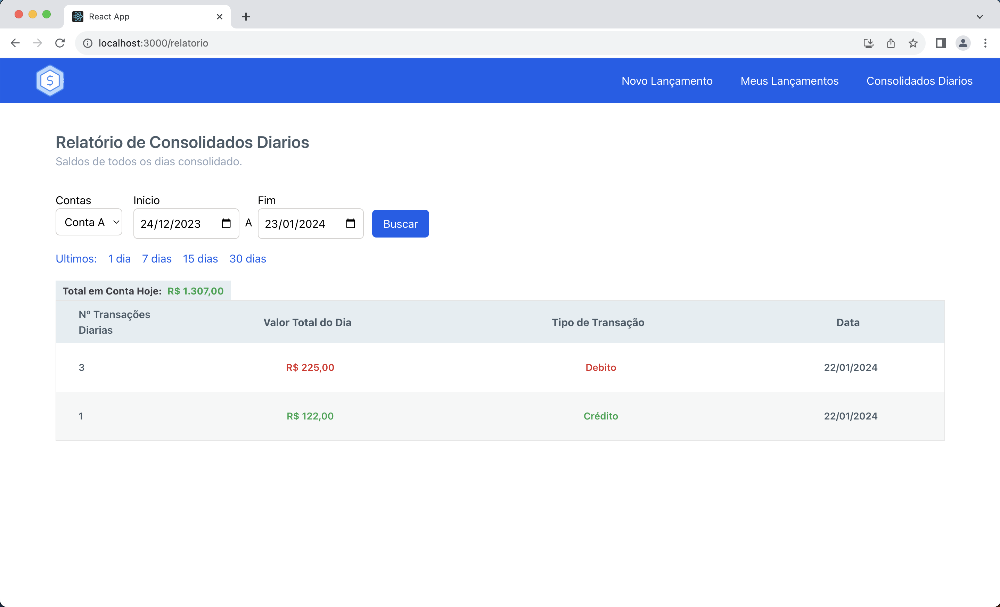

# Desafio Arquitetura De Consolidador Financeiro

Sistema de controle de fluxo de caixa diario, baseado em lançamentos e relatórios.

## Arquitetura

#### Leia o <a href="./Arquitetura//Documento de Arquitetura.pdf">Documento de Arquitetura</a> para todos os detalhes.


<i>Arquitetura baseada em microsserviços, utilizando docker para administrar os containers e imagens.</i>

## Plataforma


<i>Aqui você pode fazer o lançamento de um Debito ou Crédito.</i>

<br/>

<i>Aqui obter um historico do seus lançamentos.</i>

<br/>

<i>Aqui obter um relatorio consolidado <b>diario</b> de seu saldo.</i>

## Pré-requisitos

- [Docker](https://www.docker.com/)
- [Docker Compose](https://docs.docker.com/compose/)
- [Node.js](https://nodejs.org/) (para executar comandos npm)

## Passos

1. **Clone o repositório:**

   ```bash
   git clone https://github.com/yanagassi/arquitetura_ms_dotnet
   ```

2. **Acesse a pasta do projeto:**

   ```bash
    cd arquitetura_ms_dotnet/Source
   ```

3. **Inicie os contêineres do Docker:**

   ```bash
   docker-compose up --build
   ```

4. **Acesse a aplicação React:**

   ```bash
   cd front
   ```

5. **Instale as dependências do Node.js:**

   ```bash
   npm install
   ```

6. **Inicie o servidor de desenvolvimento React**
   ```bash
   npm start
   ```

#### \* O sistema já cria um usuario, senha e conta bancaria automaticamente, o login já é preenchido automaticamente na pagina de Login no frontend.

#### \* Lembre-se de desativar a politica de CORS do seu navegador, pois o API Gateway sobe na porta 80 pelo docker.
